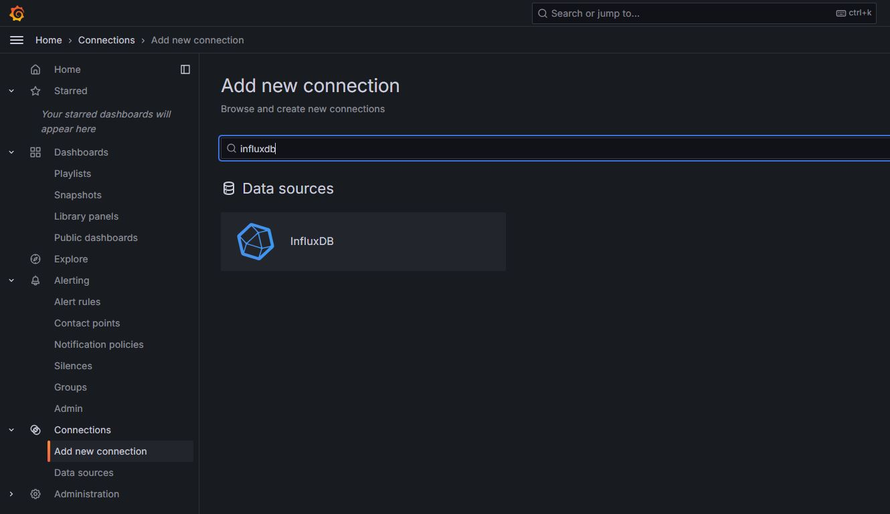
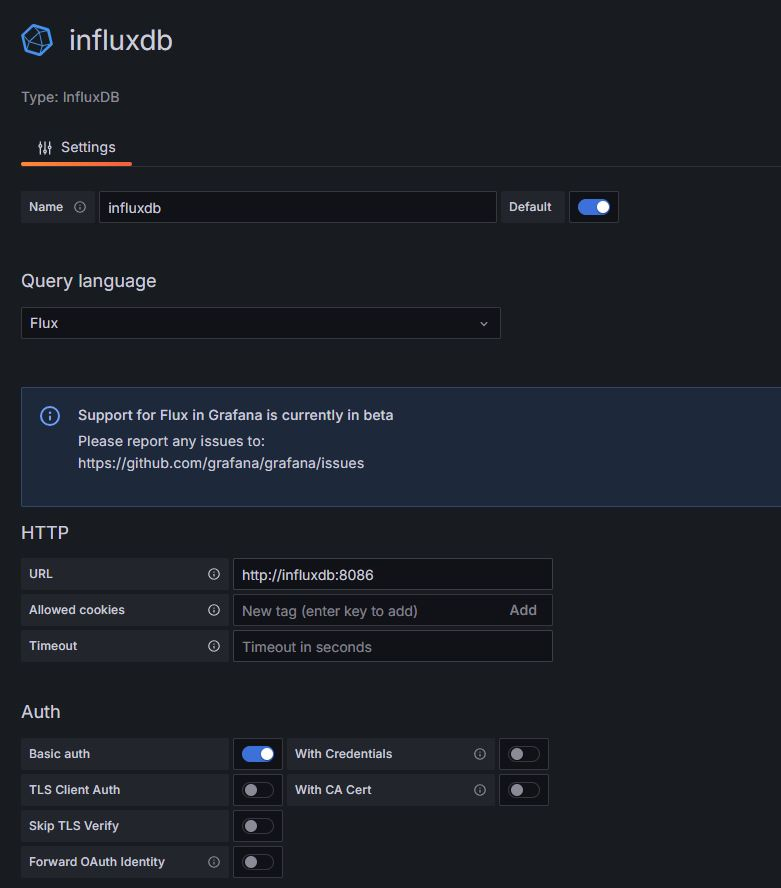
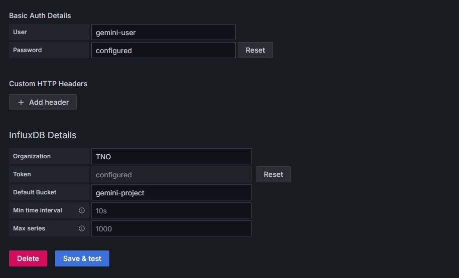
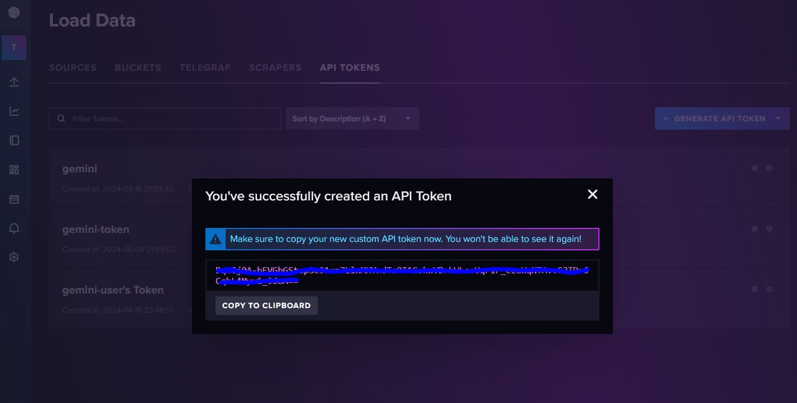
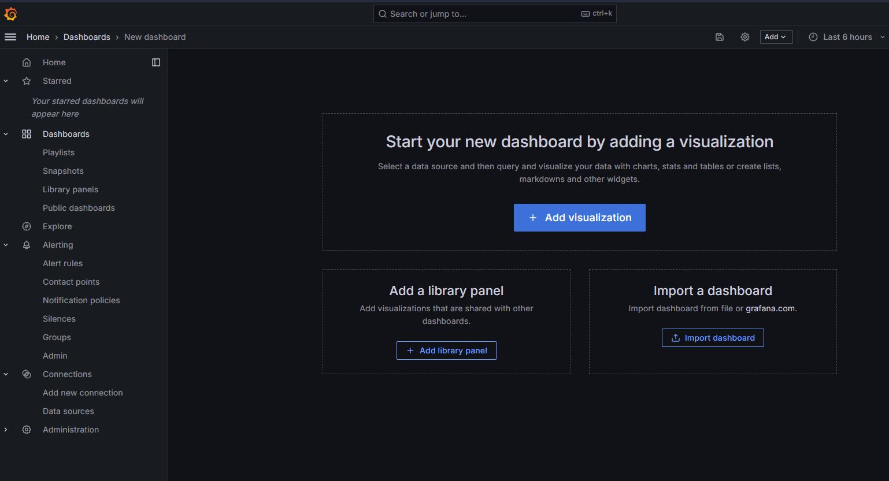
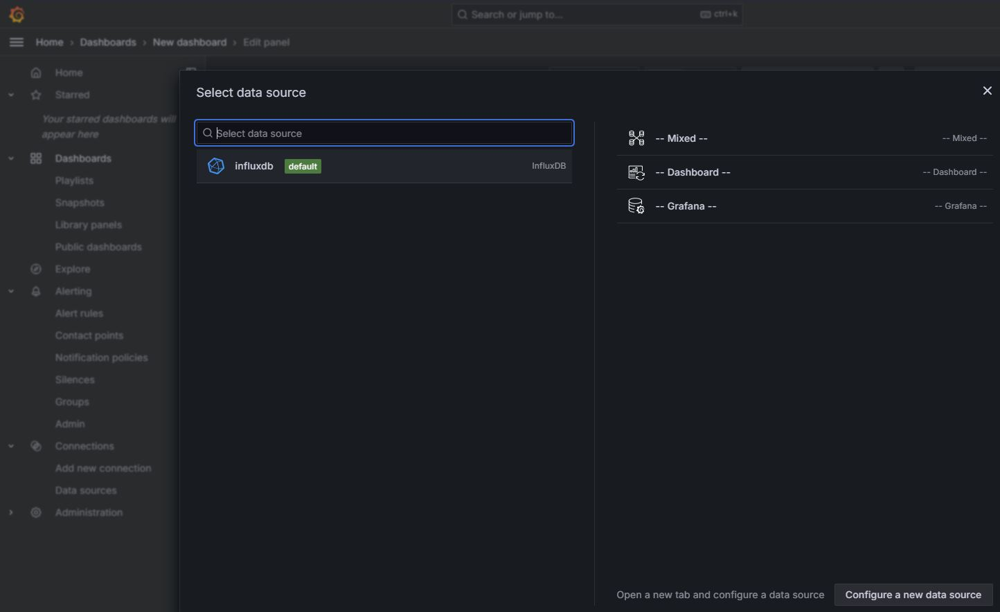
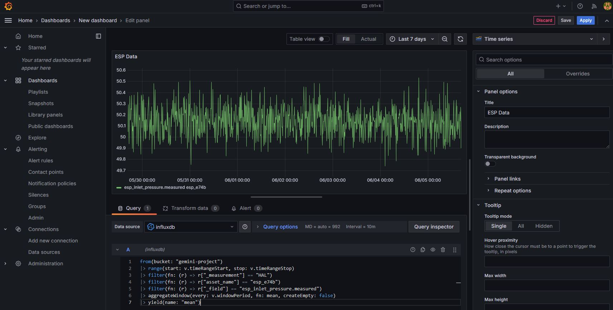
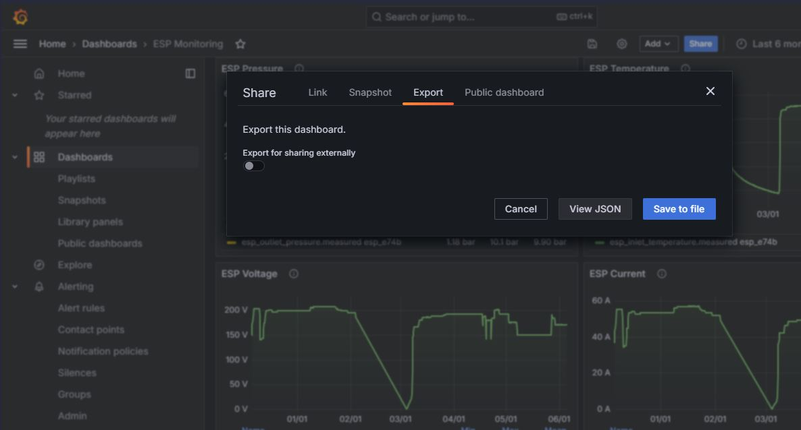
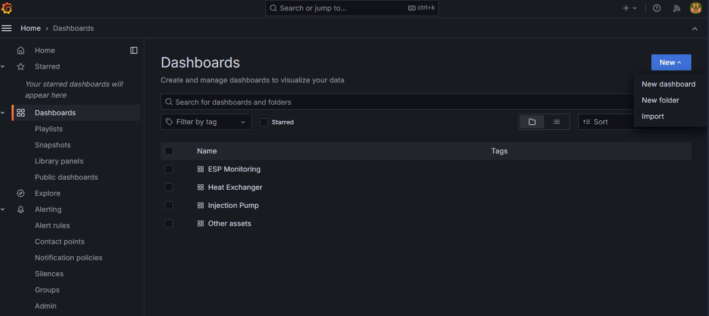
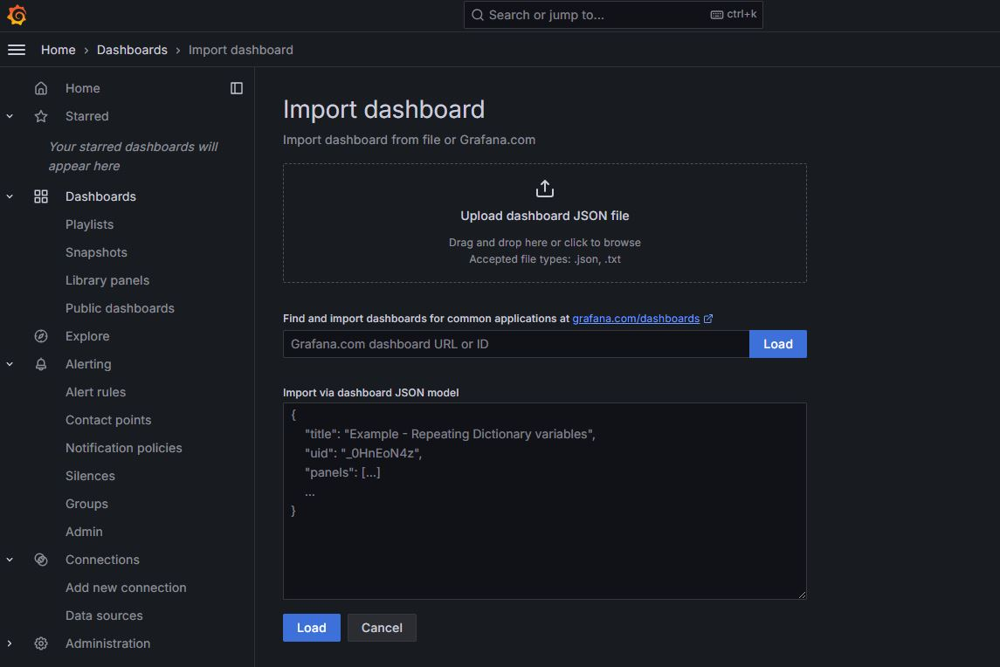

Time Series Viewer
===========================

The Time Series Viewer integrates Grafana in GEMINI for real-time and
historical trend analysis.

Set up the InfluxDB data source
-------------------------------

1. Open **Connections** in Grafana.
2. Click **Add new connection**.
3. Search for ``influxdb`` and select **Data Source InfluxDB**.
4. Click **Add new data source**.

5. Configure the connection:

   * Database name: choose a clear name (for example ``gemini-influxdb``)
   * Query language: ``Flux``
   * URL: ``http://influxdb:8086``
   * Enable **Basic auth**

6. Fill **Basic Auth** credentials:

    * Username: <you can find in your .env file>
    * Password: <you can find in your .env file>

7. Fill **InfluxDB Details**:

    * Organization: <you can find in your .env file>
    * Token: <create token InfluxDB> (Follow the steps below to create a token)
    * Default Bucket: <you can find in your .env file>

8. Click **Save & test**.

Create an InfluxDB token
~~~~~~~~~~~~~~~~~~~~~~~~
If you do not have a token yet:

1. Open ``<yourdomain>:8086`` in a browser.
2. Sign in with the same credentials used for basic authentication.
3. Create an API token (for example **All Access API Token**).
4. Copy the token and paste it into Grafana.

Create a dashboard
------------------
1. Click **New**.
2. Click **Add visualization**.

3. Select your InfluxDB data source.
   If no data source is available, complete the setup section above first.

4. Choose a panel type (for example **Time Series**).
5. Set a panel title.
6. Enter a Flux query in query box ``A``.

.. code-block::

    from(bucket: "gemini-project")
    |> range(start: v.timeRangeStart, stop: v.timeRangeStop)
    |> filter(fn: (r) => r["_measurement"] == "HAL")
    |> filter(fn: (r) => r["asset_name"] == "esp_e74b")
    |> filter(fn: (r) => r["_field"] == "esp_inlet_pressure.measured")
    |> aggregateWindow(every: v.windowPeriod, fn: mean, createEmpty: false)
    |> yield(name: "mean")

Query parameter meaning:

* ``_measurement``: project name
* ``asset_name``: component/asset name
* ``_field``: tag to visualize

Export a dashboard
------------------

1. Click **Share**.
2. Open the **Export** tab.
3. Click **Save to file**.

Import a dashboard
------------------
1. Click **New**.
2. Click **Import**.

3. Upload a JSON file from
   ``gemini-project/_template/grafana_template``,
   or paste JSON text directly.

