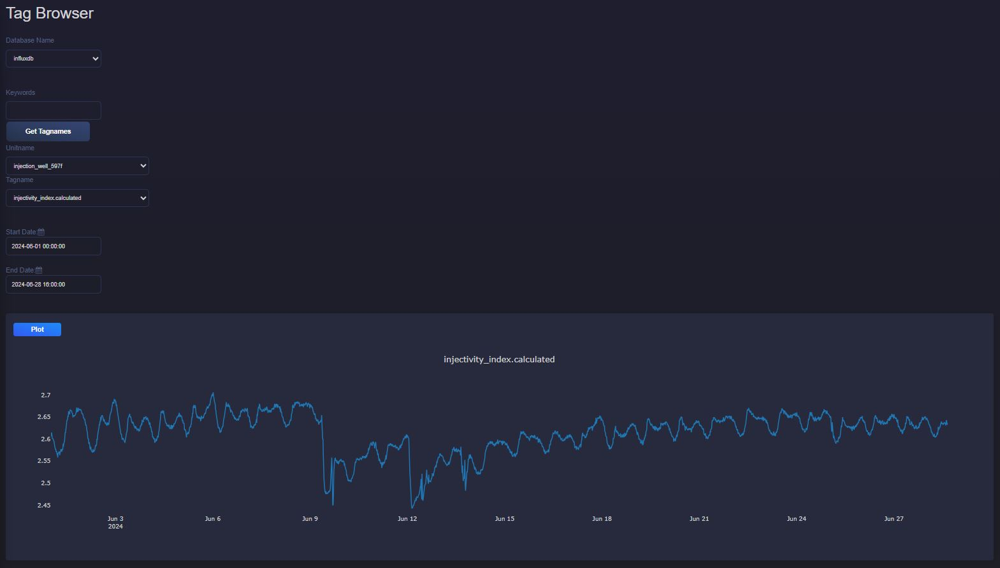
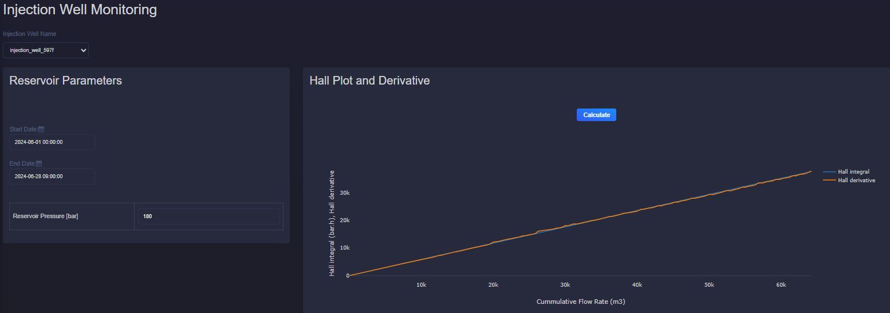
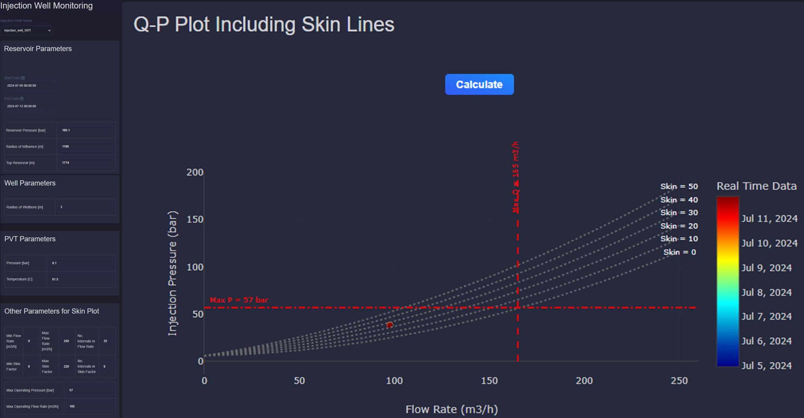

Injectivity Application
===========================

Description
---------------------------
This application provides monitoring and diagnostic tools for injection wells in
geothermal reservoirs.

Injectivity Index
---------------------------
The injectivity index (:math:`II`) quantifies how easily a reservoir accepts
injected fluid. It is derived from Darcy's law
(:math:`Q = - \frac{kA}{\mu L} \Delta P`):

.. math::

    II = -\frac{Q}{\Delta P} = -\frac{Q}{P_{res} - BHP}

where:

- :math:`Q` is the injection rate
- :math:`P_{res}` is the reservoir pressure
- :math:`BHP` is the bottomhole pressure
- :math:`\Delta P` is the pressure difference (reservoir pressure - bottomhole pressure)

Injectivity index can be plotted for a selected well and time range through the
Tag Browser.

Hall plot and derivative
----------------------------
The Hall integral is a standard injectivity diagnostic. It integrates pressure
difference over time and plots it against cumulative flow.

The Hall integral (:math:`HI`) is given by:

.. math::

    HI = \int_{0}^{t} (\Delta P) dt

where:

- :math:`\Delta P` is the pressure difference (bottomhole pressure - reservoir pressure)
- :math:`t`  is the time

The Hall derivative (:math:`D_{Hall}`) can be computed numerically as:

.. math::

    D_{Hall} = \frac{d \int_{0}^{t} (\Delta P) dt}{d \ln (Q)}

where:

- :math:`\Delta P` is the pressure difference (bottomhole pressure - reservoir pressure)
- :math:`t`  is the time
- :math:`Q` is the flow rate

The application allows users to choose time range and reservoir pressure for Hall
analysis.

When Hall and Hall-derivative trends are stable, the system generally indicates
no major plugging or stimulation effect.

Skin factor plot
---------------------------
The skin-factor plot compares measured flow/pressure data to model-derived skin
lines. For a given flow rate and skin value, injection pressure can be
calculated. A positive skin factor usually indicates formation damage and may
require treatment.

.. math::

    P_{inj} = BHP - \Delta P_{hydrostatic} + \Delta P_{fric}

    BHP = P_{reservoir} + \Delta P_{flow} + \Delta P_{skin}

    \Delta P_{hydrostatic} = \rho_{brine} . g . H_{top res}

    
    \Delta P_{flow} = \frac{Q \cdot \mu_{brine} \cdot \ln\left(\frac{r_{res}}{r_{well}}\right)}{2 \cdot \pi \cdot k \cdot h}

    \Delta P_{skin} = \frac{Q \cdot \mu_{brine} \cdot \text{Skin}}{2 \cdot \pi \cdot k \cdot h}

Friction loss is calculated with Darcy-Weisbach and a Swamee-Jain friction
factor:

.. math::
    
    \Delta P_{fric} = f \cdot \rho_{brine} \cdot \frac{L}{D} \cdot \frac{V^2}{2}

    f = \frac{0.25}{\left(\log_{10} \left(\frac{\varepsilon}{3.7 D} + \frac{5.74}{Re^{0.9}}\right)\right)^2}

    Re = \frac{v \cdot L \cdot \rho_{brine}}{\mu_{brine}}

where:

- :math:`Q` is the injection rate
- :math:`P_{inj}` is the calculated pressure for a given flow rate and skin factor
- :math:`H_{top res}` is the top reservoir depth
- :math:`\mu_{brine}` is the viscosity of the brine
- :math:`\rho_{brine}` is the density of the brine
- :math:`r_{res}` is the radius of influence of the reservoir
- :math:`r_{well}` is the well radius
- :math:`k` is the reservoir permeability
- :math:`h` is the reservoir thickness
- :math:`L` is the well length
- :math:`D` is the well diameter
- :math:`V` is the velocity inside the well
- :math:`f` is the friction coefficient of the well
- :math:`\varepsilon` is the roughness of the well
- :math:`Re` is the Reynolds number

A Q-P plot with skin lines can be generated for any selected well and date range,
using the specified well and reservoir parameters.

