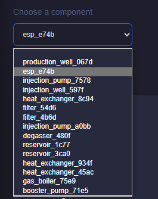
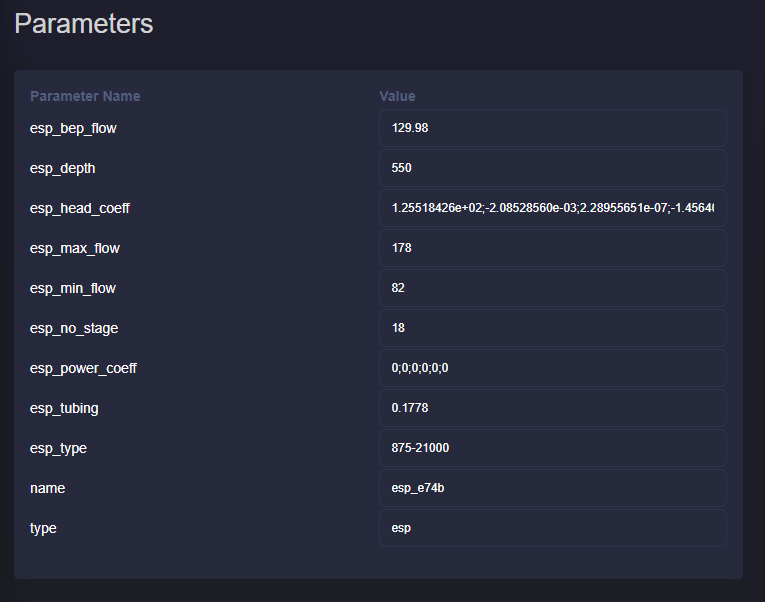
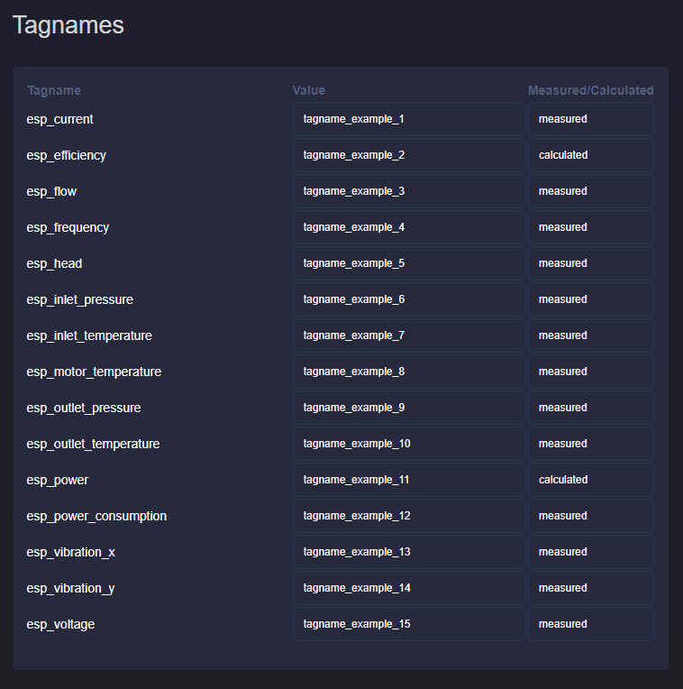

Parameters overview
===========================

Description
---------------------------
This application provides a consolidated view of component parameters and
tagnames for the active project plant model.

Overview of parameters and tagnames
-------------------------------------

Select an asset from the dropdown list. The list is populated from the current
project diagram. If no diagram exists, the dropdown remains empty.

When an asset is selected, tables are updated automatically. If an asset has no
custom name, GEMINI generates one from asset type and the first four ID
characters.

The parameter table shows parameter names and editable values. For array-based
fields such as ``esp_head_coeff`` or ``esp_power_coeff``, separate values with
semicolons (``;``).

The tagname table shows tag names, mapped values, and measured/calculated type.
Like parameters, these fields are editable.

Modify parameters
----------------------------
Use this page both to review and to update parameters/tags.

Click **Update** (bottom-left) to save changes. Save before switching to another
asset to prevent losing edits.
