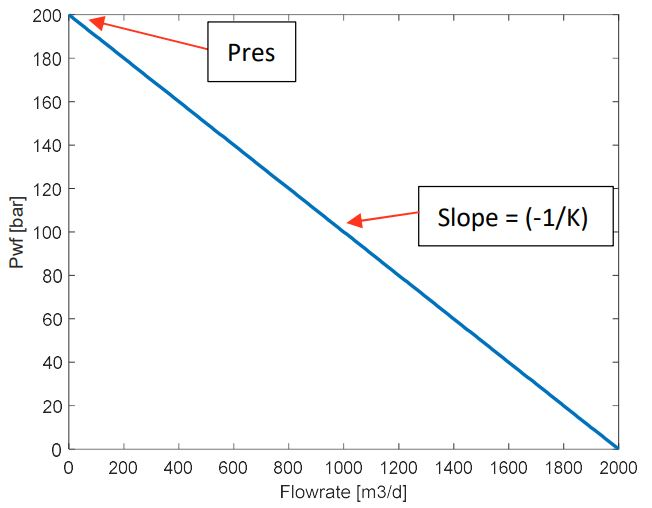
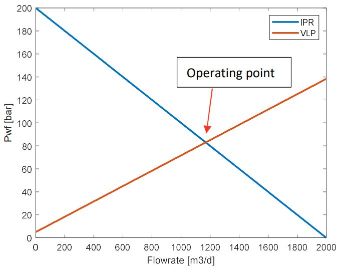
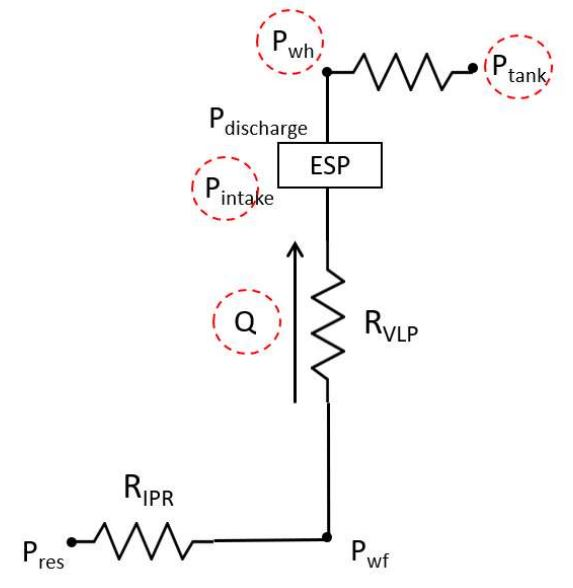
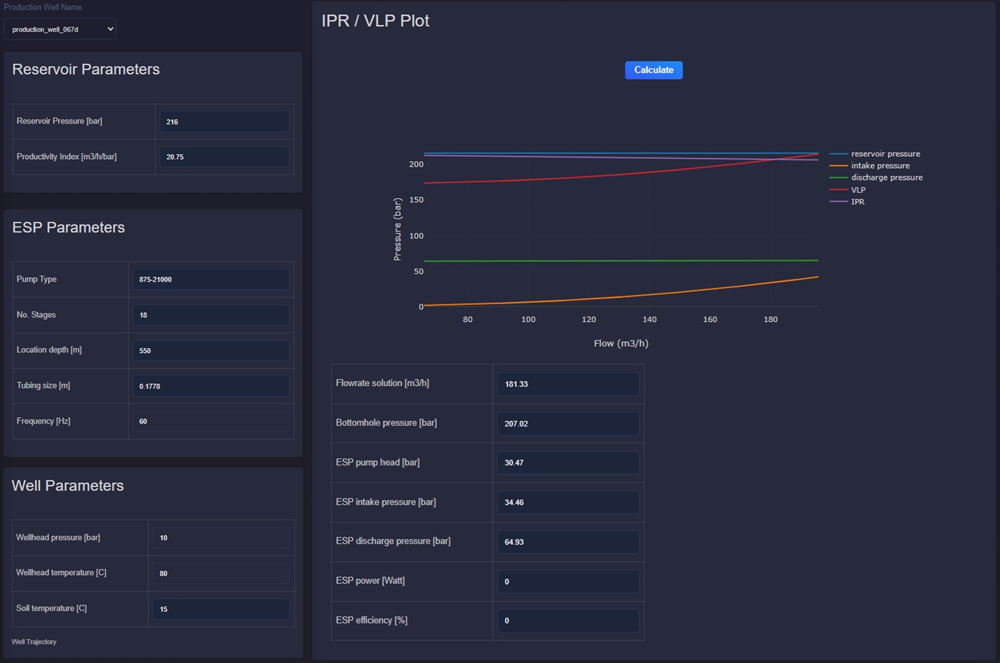

Production well performance
===========================

Description
---------------------------
This application supports real-time and engineering analysis of production well
behavior in geothermal reservoirs. It combines IPR, VLP, and nodal analysis.

Inflow Performance Relationship (IPR)
--------------------------------------
The Inflow Performance Relationship (IPR) describes flowing bottomhole pressure
(:math:`P_{wf}`) as a function of production rate (:math:`Q`). It is used for
well productivity analysis and operating point selection.

In the IPR curve, the y-intercept represents reservoir pressure at zero flow.
The slope parameter :math:`K` is the productivity index.

.. math::

    P_{wf} = P_{res} - \frac{Q}{K}

    K = \frac{Q}{P_{res} - P_{wf}}

where:

- :math:`P_{res}` is the reservoir pressure
- :math:`P_{wf}` is the flowing bottomhole pressure
- :math:`Q` is the flow rate
- :math:`K` is the productivity index

Vertical Lift Performance (VLP)
--------------------------------
Vertical Lift Performance (VLP) describes bottomhole pressure as a function of
tubing flow rate. It depends on well depth/trajectory, tubing geometry, fluid
properties, and multiphase behavior.

Boundary conditions:

* without ESP: wellhead pressure :math:`P_{wh}`
* with ESP: ESP intake pressure

To calculate the pressure drop along the tubing, two correlations are used based on fluid phase: single-phase or two-phase. 

For single-phase flow, pressure loss includes gravitational and friction
components.

.. math::
    
    \Delta P_{grav} = \rho_{l} g \sin \theta 

where:

- :math:`\Delta P_{grav}` is the gravitational pressure drop 
- :math:`\rho_{l}` is the liquid local density
- :math:`g` is the local acceleration due to gravity
- :math:`\theta` is the tubing inclination

The frictional pressure drop is proportional to the square of the flow velocity and inversely proportional to the pipe diameter, as described by the Darcy-Weisbach equation. 

.. math::
    
    \Delta P_{fric} = \lambda \frac{1}{2} \rho_{l} \frac{u^2}{D} 

where:

- :math:`\lambda` is the friction factor or flow coefficient
- :math:`u` is the mean velocity
- :math:`\rho_l` is the liquid local density
- :math:`D` is the pipe diameter

In turbulent flow, the friction factor :math:`\lambda` depends on Reynolds number
:math:`Re` and can be solved iteratively or approximated by:

.. math:: 
    \lambda = \left[0.86859 \ln\left(\frac{Re}{1.964 \ln(Re) - 3.8215}\right)\right]^{-2}

    Re = \frac{uD}{v}

where:

- :math:`Re` is the Reynolds number
- :math:`u` is the mean velocity
- :math:`D` is the pipe diameter
- :math:`v` is the kinematic viscosity

Thus, total pressure loss is calculated by:

.. math::
    
    \Delta P_{total} = \Delta P_{fric} + \Delta P_{grav}

    P_{wf} = P_{wh} + \Delta P_{total}
 
For two-phase flow in inclined pipes, liquid holdup must be included. Holdup
depends on flow angle and flow regime (segregated, intermittent, distributed).

Nodal Analysis
---------------
Nodal analysis combines IPR and VLP. The intersection defines the operating
point and corresponding flow rate.

The operating flow rate can be found by minimizing the difference between
:math:`P_{wf}` from IPR and :math:`P_{wf}` from VLP.

.. math::
    
    \text{min}_Q (P_{wf,1} - P_{wf,2}) ^2 

For systems without ESP, use wellhead pressure :math:`P_{wh}` as topside
boundary condition. If unavailable, use tank/pipeline pressure with additional
pressure-drop corrections. For systems with ESP, use intake pressure.

In real-time monitoring, discrepancies between measured and calculated
:math:`P_{wf}` can indicate changing well conditions. If downhole pressure is not
available, compare nodal-analysis flow rate with measured flow rate to detect
potential additional resistance in the well.

Users can adjust reservoir, well, and ESP parameters to evaluate impact on:

* operating flow rate
* bottomhole pressure
* ESP head, intake/discharge pressure
* power and efficiency

