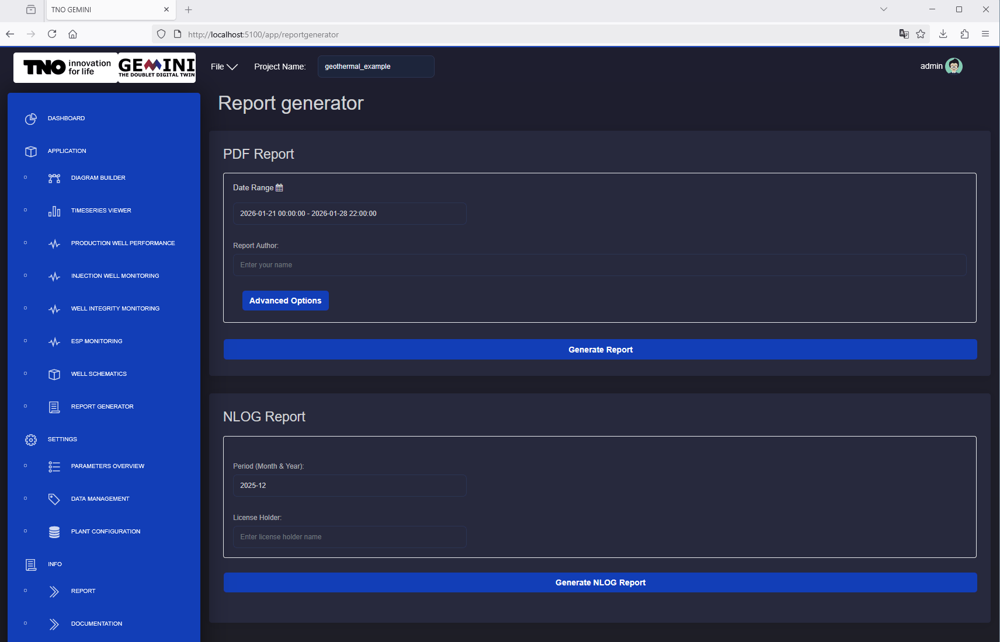

Report Generator
===========================

Description
---------------------------
The Report Generator automates repetitive operational reporting tasks. Users can
generate standardized PDF and NLOG reports directly from GEMINI.

PDF report
---------------------------
The PDF report includes sections for injection wells, production wells, and ESPs,
with summary tables and operational plots.

**Time range and Author**

To generate a PDF report, select start and end date. The author field is
optional.

.. figure:: animations/application_report_generator_1.gif
    :width: 100%
    :align: center

    Time range and author's name fields for the generation of reports.
    Date is defined with a dedicated input dialog.

**Default options**

By default, all available report sections are included:

- Title page
- Summary table providing overview of injection wells and production wells with statistical values.
- Summary plots providing overview of injection wells and production wells with time-series plots and maximum values.
- Injection well report with comprehensive time series values plot.
- Production well report with comprehensive time series values plot.
- ESP report with comprehensive time-series values plot.
- Injection well cross plots with skin lines.
- ESP cross plots.

**Advanced options**

In **Advanced Options**, users can:

* enable/disable specific report sections
* adjust skin-line flow range and skin-factor values
* configure ESP plot limits and included plot types
* add section-specific notes/comments

.. figure:: animations/application_report_generator_2.gif
    :width: 100%
    :align: center

    The button Advanced Options reveals the options menu.
    The user can adjust the report according to their needs.

NLOG report
---------------------------
The NLOG output is generated in Microsoft Excel format. The workbook includes VBA
logic for XML export through the **Exporteer naar XML** button.

**Important:** On some systems, the Excel file must be opened from a trusted
location for VBA execution.

**Time range and License Holder**

NLOG generation requires month/year and license holder. NLOG reports are always
generated for a single month.

.. figure:: animations/application_report_generator_3.gif
    :width: 100%
    :align: center

    Period and License Holder inputs.

**Generation**

After entering required inputs:

* **Generate Report** returns the PDF report
* **Generate NLOG Report** returns the Excel NLOG report

    The button Generate NLOG Report prepares the EXCEL file. The file can be downloaded directly from the browser.
