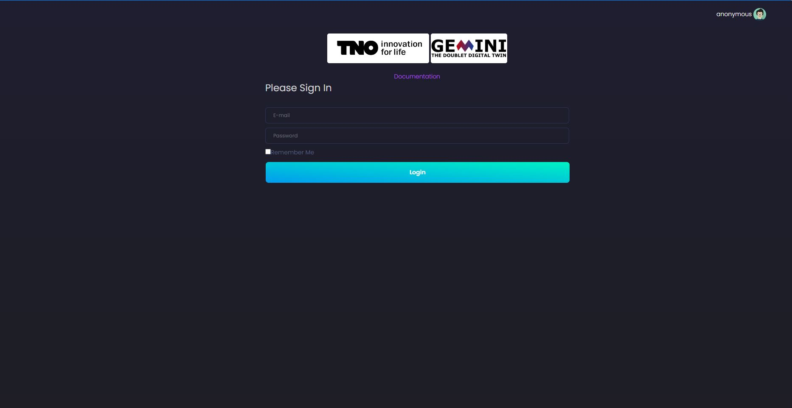
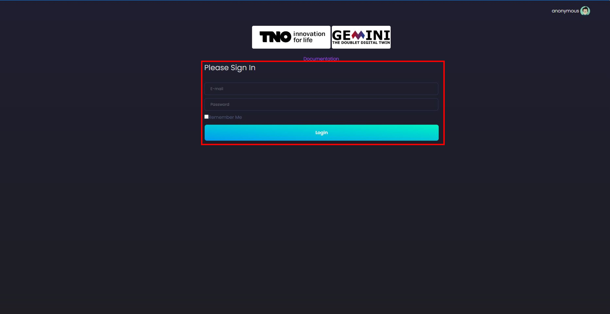

Login Page
================================

This page explains user access management and daily login actions.

Sign Up
--------------------------------
Users cannot self-register. Account creation must be performed by an
administrator.

Administrator steps:

1. Log in with administrator credentials.
2. Open user management from the top-right user menu and select ``Add User``.

   .. image:: images/Start_login_signup.JPG
       :width: 100%

3. Fill in the new user's details (email, name, temporary password) and click
   **Sign Up**.

   .. image:: images/Start_login_signup_1.JPG
       :width: 100%

   .. image:: images/Start_login_signup_2.JPG
       :width: 100%

Sign In
--------------------------------
A registered user can sign in using email and password.

After a successful login, the user is redirected to the main page.

Log Out
--------------------------------
To sign out, open the top-right user menu and select ``Log Out``.

