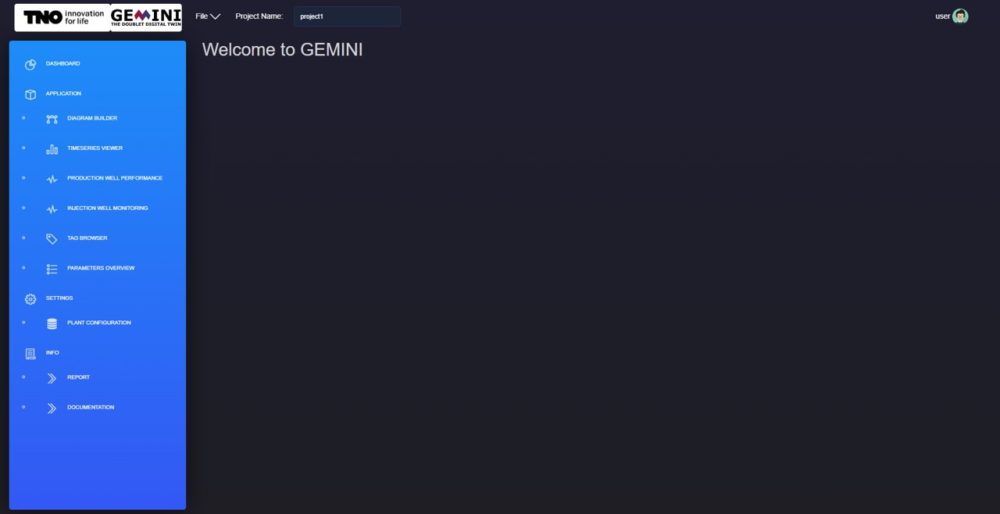

Main Page Overview
===========================

After opening a project, the main page is the operational entry point for
applications, settings, and project information.

Dashboard
-----------------------------

The dashboard groups features into three sections: **Applications**,
**Settings**, and **Info**.

    .. image:: images/Start_mainpage_0.jpg
        :width: 100%

Applications
-----------------------------
- Diagram Builder:
    Build the plant diagram and configure component parameters.

    .. image:: images/Start_mainpage_1.jpg
        :width: 100%

- Timeseries Viewer:
    Opens Grafana for real-time monitoring of measured and calculated signals.
    See :doc:`application_grafana`.

    .. image:: images/Start_mainpage_2.jpg
        :width: 100%

- Production Well Performance and Injection Well Monitoring:
    Provides advanced well monitoring tools (for example IPR/VLP, Hall plot, and
    skin analysis). See :doc:`index_applications`.

    .. image:: images/Start_mainpage_3.jpg
        :width: 100%

- Tag Browser:
    Plot selected tags for a component over a chosen time window.

    .. image:: images/Start_mainpage_4.jpg
        :width: 100%

- Parameters Overview:
    View and edit component parameters and tag mappings.

    .. image:: images/Start_mainpage_5.jpg
        :width: 100%

Settings
-----------------------------

- Plant Configuration:
    Configure plant timing settings and database connection settings.

    .. image:: images/Start_mainpage_6.jpg
        :width: 100%

Info
-----------------------------

- Report:
    Upload and view project reports (for example P&IDs).

    .. image:: images/Start_mainpage_7.jpg
        :width: 100%

- Documentation:
    Open this user manual.

    .. image:: images/Start_mainpage_8.jpg
        :width: 100%
