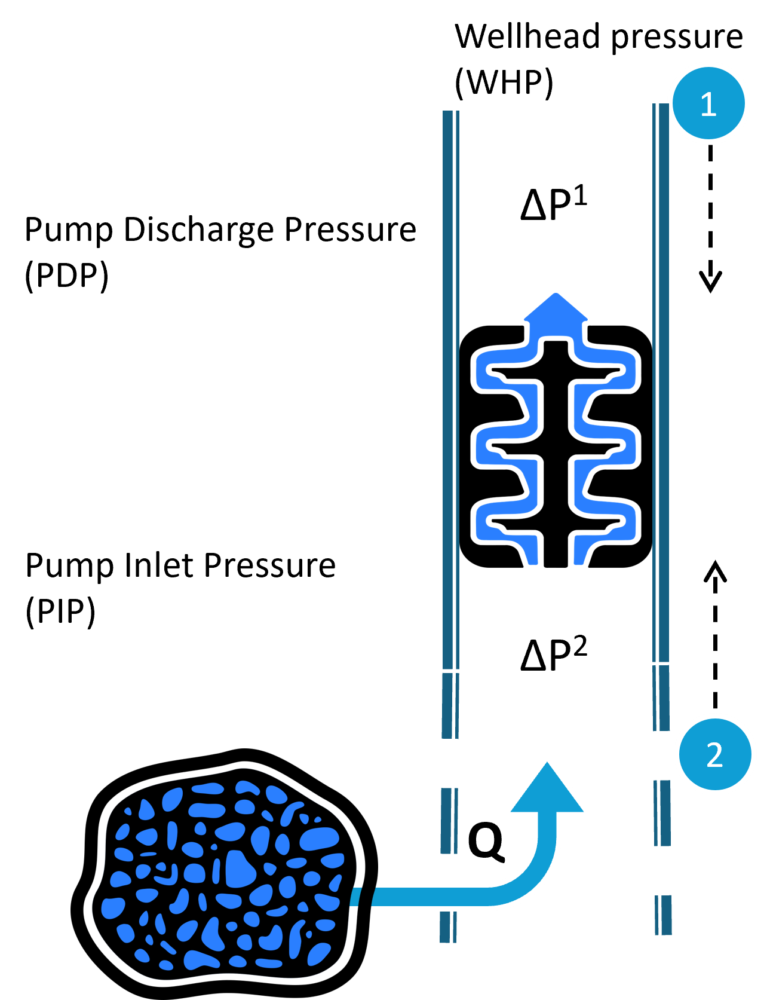
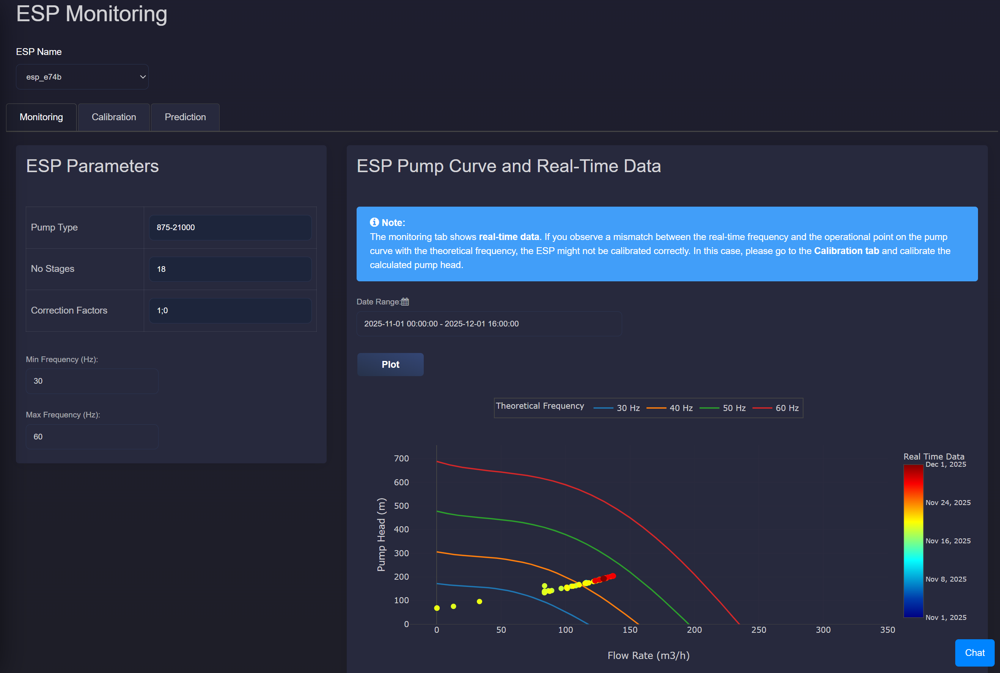
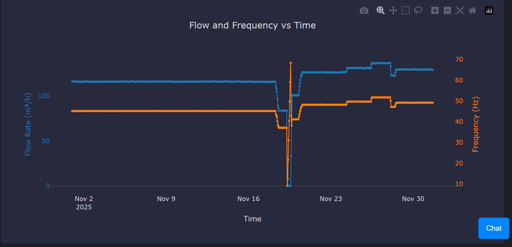
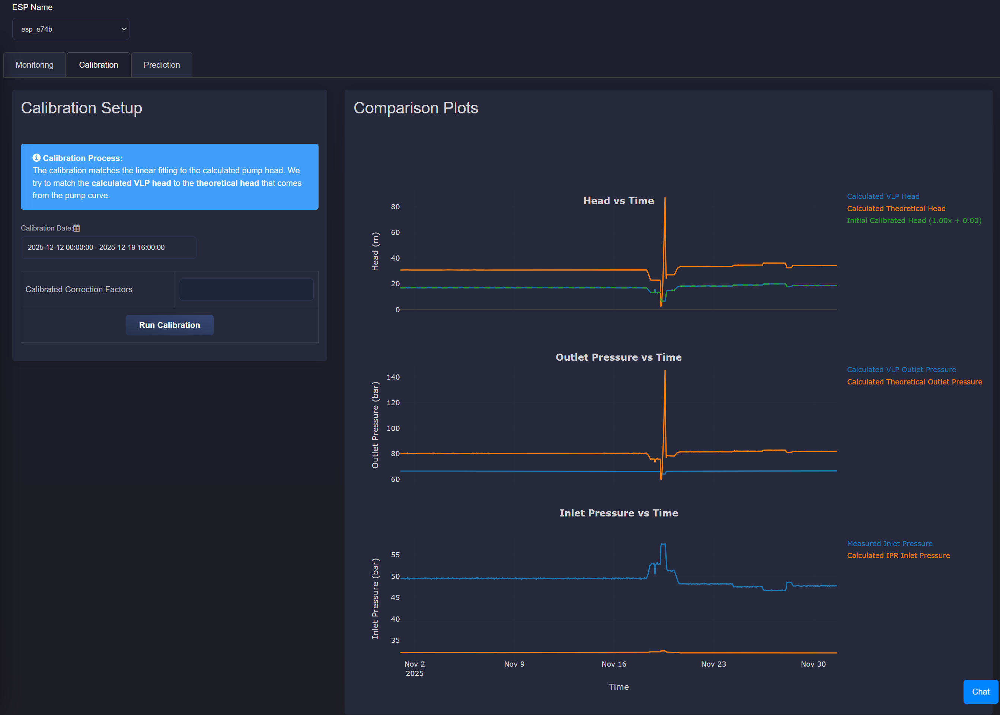
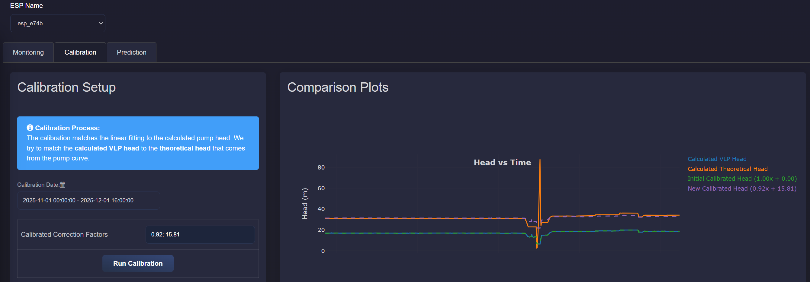
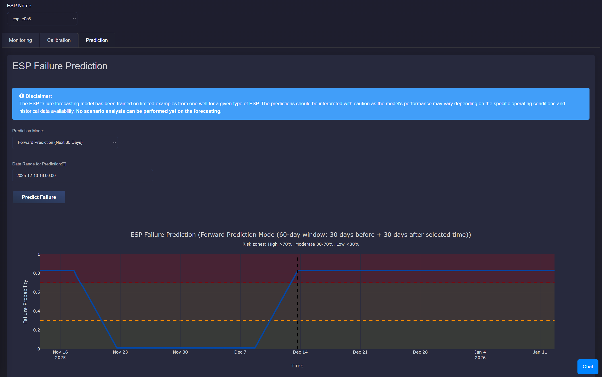
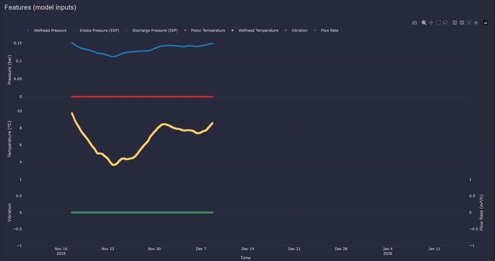
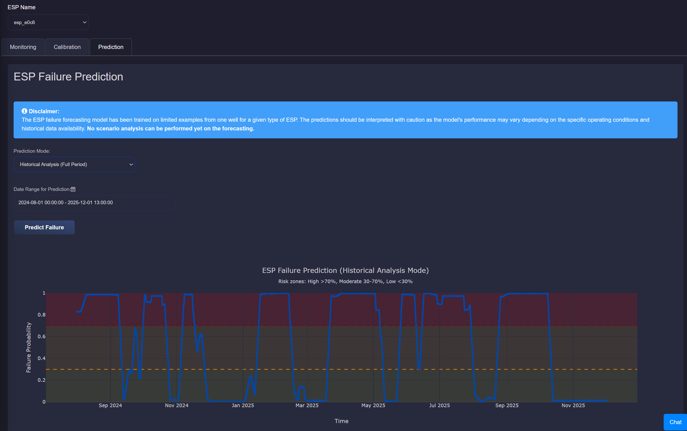
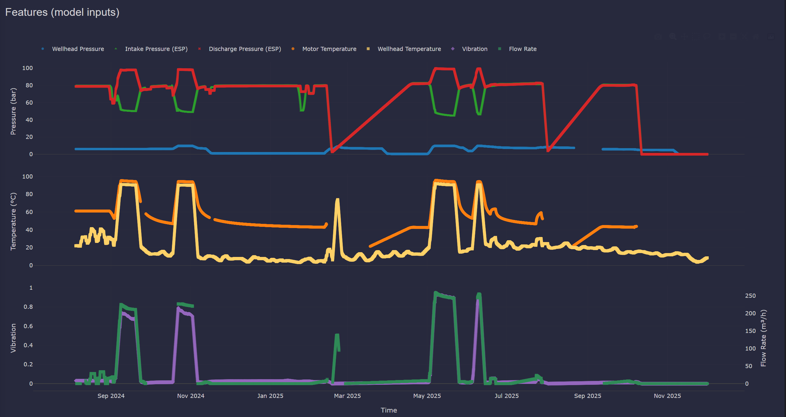

ESP Performance
===========================

Description
---------------------------

This application provides comprehensive monitoring, calibration, and failure prediction capabilities for Electric Submersible Pumps (ESP) in geothermal reservoirs.

ESPs are installed in production wells to provide additional lift when the reservoir pressure is not sufficient to bring the fluid to the surface. They increase pressure between the pump intake (inlet) and discharge (outlet).

The schematic below illustrates a typical pressure profile across a geothermal production well equipped with an ESP:

The application is organized into three main tabs: **Monitoring**, **Calibration**, and **Prediction**.

Monitoring Tab
---------------------------

The Monitoring tab provides real-time visualization of ESP performance and operational data.

**ESP Pump Curve and Real-Time Data**

This section shows the ESP pump curve from the manufacturer, plotted as head versus flowrate. On top of this, real-time operating data is added to show actual pump performance.

The pump curve displays theoretical frequency lines (typically 30, 40, 50, and 60 Hz) as "Theoretical Frequency" in the legend. The real-time operational point is overlaid on the pump curve, allowing users to compare actual performance against expected behavior.

Since there is usually no discharge pressure sensor in the ESP system, the pump head is estimated using two values:

- Inlet pressure, measured directly by a downhole sensor.

- Upper pressure difference (:math:`\Delta P^{1}`), calculated using the VLP (as described in :doc:`application_production_well_performance`) from the top of the ESP to the wellhead.

From these, we estimate the actual pressure increase provided by the pump. This gives us the real-time pump head, which is plotted with the flowrate on top of the manufacturer pump curve.

**Flow and Frequency Plot**

A time-series plot displays the measured flow rate and frequency over the selected date range. This helps users identify operational patterns and potential issues with pump performance.

**Note on Calibration**

If there is a mismatch between the real-time frequency and the operational point on the pump curve with the theoretical frequency, the ESP might not be calibrated correctly. In such cases, users should proceed to the Calibration tab to calibrate the calculated pump head.

Calibration Tab
---------------------------

The Calibration tab enables users to calibrate the ESP model by aligning calculated values with theoretical expectations.

**Calibration Process**

The calibration matches the linear fitting to the calculated pump head. The goal is to match the **calculated VLP head** to the **theoretical head** that comes from the pump curve.

By clicking "Run Calibration", the application performs a linear fit of the form :math:`ax+b` for a selected time period. The calibration coefficients :math:`a` and :math:`b` are displayed in the calibration window and can be saved in the Parameters Overview so the calibration is applied to future ESP performance evaluations.

**Comparison Plots**

This section shows time-based comparisons between real-time measurements and expected values from ESP models:

**Head Comparison**

This is the most critical plot, used in the calibration step. It includes:

- VLP Head: calculated using pressure drop from the top of the ESP to the wellhead (since no discharge sensor is available) and measured intake pressure.

- Theoretical Head: calculated from the manufacturer pump curve using current flow and frequency.

- Calibrated Head: VLP head adjusted using calibration coefficients (if applied) to better match the theoretical head.

If no calibration is applied, default values are used with :math:`a = 1` and :math:`b = 0`. This helps users to see the initial mismatch between measured and expected pump behavior.

**Outlet Pressure Comparison**

Since there is no discharge pressure sensor, it shows:

- VLP-based Outlet Pressure: calculated from the pressure drop above the ESP and wellhead pressure.

- Theoretical Outlet Pressure: calculated using the measured inlet pressure and theoretical pump head.

**Inlet Pressure Comparison**

This compares:

- Measured Inlet Pressure: from the ESP sensor at the pump intake.

- Calculated Inlet Pressure: calculated from IPR (using reservoir pressure and flowrate, as described in :doc:`application_production_well_performance`) and VLP (from reservoir to pump location, using bottomhole pressure and pressure drop in the lower stage of the ESP, :math:`\Delta P^{2}`).

These comparisons act as diagnostic tools to check consistency between measurements and expected values. Deviations in head, outlet, or inlet pressures may indicate uncalibrated models, measurement errors, or operational issues.

Prediction Tab
---------------------------

The Prediction tab provides ESP failure forecasting using a machine learning model trained on historical operational data.

**Prediction Modes**

The application supports two prediction modes:

- **Forward Prediction (Next 30 Days)**: Predicts failure probability for the next 30 days from a selected time point.

    

- **Historical Analysis (Full Period)**: Analyzes failure probability across the entire selected historical period.

    

**Failure Probability Plot**

The main prediction plot displays the failure probability over time with color-coded risk zones:

- **High Risk (Red)**: Probability > 0.7
- **Medium Risk (Orange)**: Probability between 0.3 and 0.7
- **Low Risk (Green)**: Probability < 0.3

For forward prediction mode, a vertical line indicates the current time point, with predictions shown for the future period.

**Features (Model Inputs)**

The application displays all sensor features used as inputs to the ML model in a consolidated plot with grouped subplots:

- **Pressures**: Wellhead pressure, Intake pressure (ESP), and Discharge pressure (ESP)
- **Temperatures**: ESP Motor temperature and Wellhead temperature
- **Vibration and Flow Rate**: Vibration and Brine flow rate

**Model Disclaimer**

The ESP failure forecasting model has been trained on limited examples from one well for a given type of ESP. The predictions should be interpreted with caution as the model's performance may vary depending on the specific operating conditions and historical data availability. No scenario analysis can be performed yet on the forecasting.