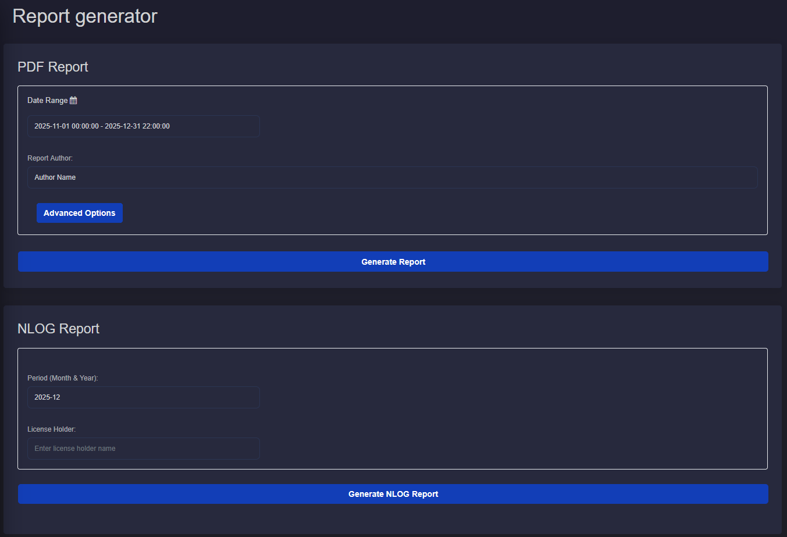

Report Generator
===========================

Description
---------------------------
The Report Generator application is a functionality of GEMINI to reduce the manual repetitive task of creating operational reports.
It can be found in the main list of applications.
The user can generate and download the reports in seconds by clicking the **Generate Report** and **Generate NLOG Report** buttons.
Advanced options are available to select or customize specific parts of the report.

PDF report
---------------------------
The first report that the user can generate comes in a PDF format and includes sections about the Injection wells, Production wells and ESPs.
It provides an overview of the plant with data and plots.

**Time range and Author**

To generate the PDF report the time range is required.
The start and end date indicate the period of time for which the data will be plot in the report.
Additionally, the author's name is good to be included but not required.

    Time range and author's name fields for the generation of reports.
    Date is defined with a dedicated input dialog.

**Default options**

By default all available plots are included in the report. Skin lines are plotted based on default parameters. These are:

- Title page
- Summary table providing overview of injection wells and production wells with statistical values.
- Summary plots providing overview of injection wells and production wells with time-series plots and maximum values.
- Injection well report with comprehensive time series values plot.
- Production well report with comprehensive time series values plot.
- ESP report with comprehensive time-series values plot.
- Injection well cross plots with skin lines.
- ESP cross plots.

**Advanced options**

With the advanced options menu the user can adjust the following:

- Disable parts of the report.
- Adjust the skin line parameters. The flow rate range can be adjusted, this is the value on the horizontal axis. The skin factor values can be adjusted which results in different range of values on the vertical axis of the cross plot.
- For the ESP plots individual plots can be disable. Minimum and maximum limit values can be included in the plots if required. The user can type the minimum or maximum value. The limits are not required to be defined. Only available limit values will be plotted.
- The user can included notes or comments in the report by typing in the empty fields. Text can be included separately for any of the four report sections. Injection Well, Prodution well and ESP report sections. Comments are not required to generate a report.

    The button Advanced Options reveals the options menu.
    The user can adjust the report according to their needs.

NLOG report
---------------------------
The second report that the user can generate is the standard NLOG report in Microsoft EXCEL format.
The EXCEL file generated by the report generator includes the VBA code to generate the XML file, which is integrated with the button "Exporteer naar XML".
The user needs to first generate the NLOG report, open and check the inputs and press the button.

**Important:** On some systems the EXCEL report needs to be inside a trusted folder for the VBA code to be able to execute successfully.
The EXCEL application will give warnings if that is the case.

**Time range and License Holder**

To generate the NLOG report the month and the License Holder are required.
The NLOG report is generated for one month, therefore the period is defined with the month and year.
The License Holder can be provided with text input.

    Period and License Holder inputs.

**Generation**

After the user has defined the required inputs the **Generate Report** will return the PDF file and the **Generate NLOG Report** will return the EXCEL file.
The reports will be available through the browser in a few seconds.

.. figure:: animations/application_report_generator_4.gif
    :width: 100%
    :align: center

    The button Generate NLOG Report prepares the EXCEL file. The file can be downloaded directly from the browser.
