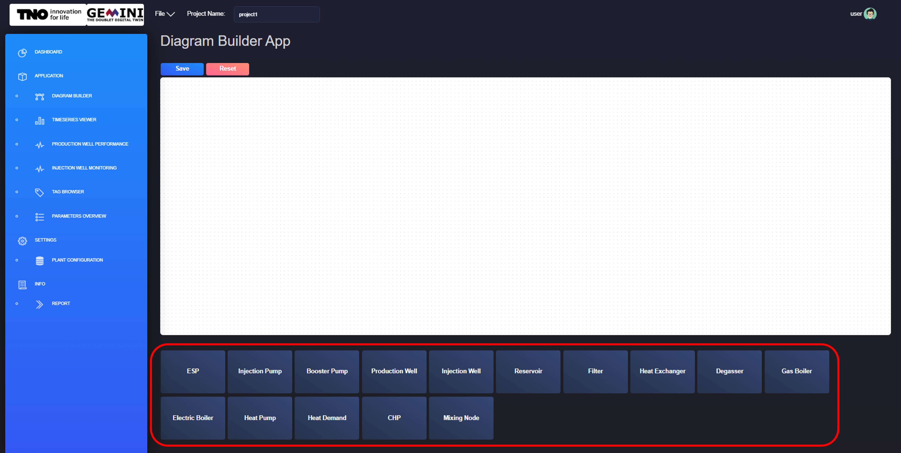
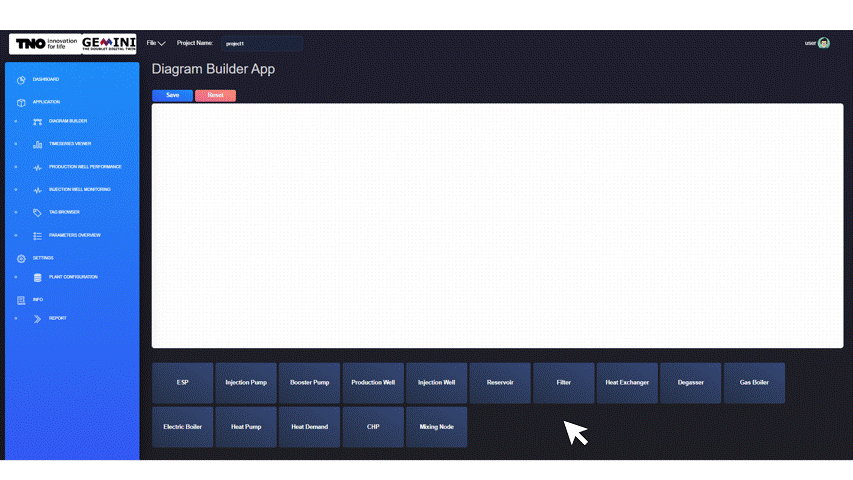
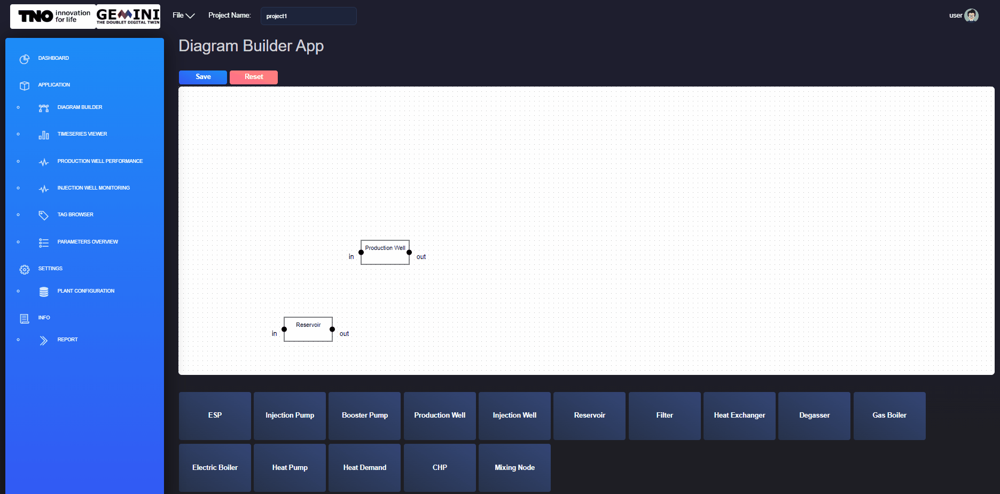
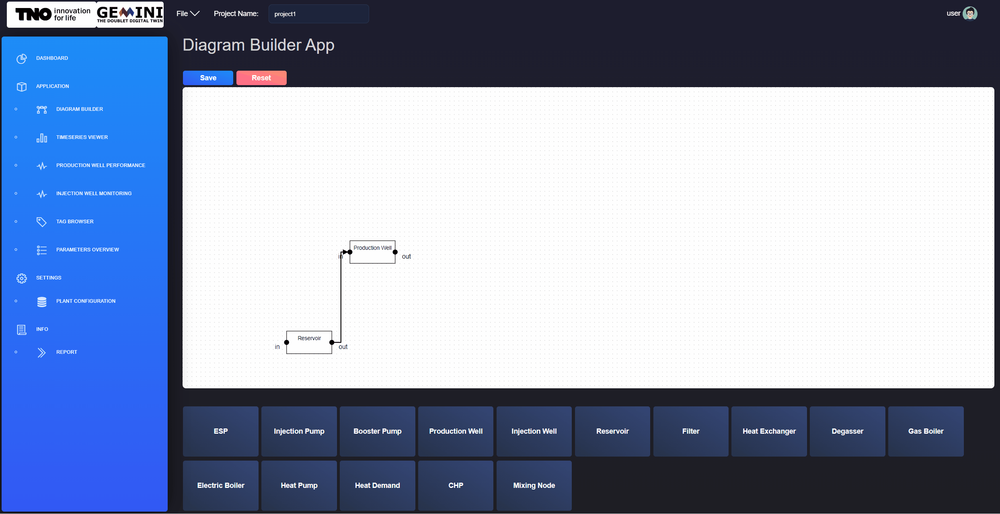
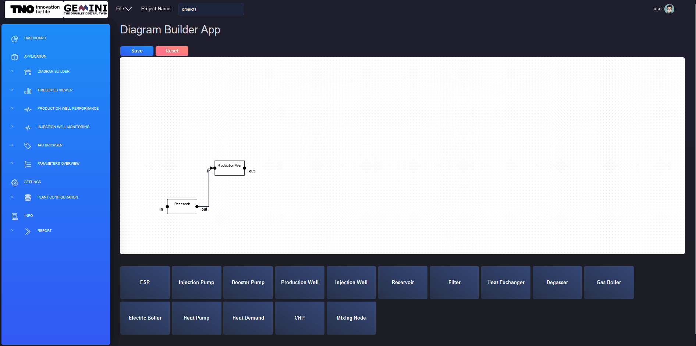
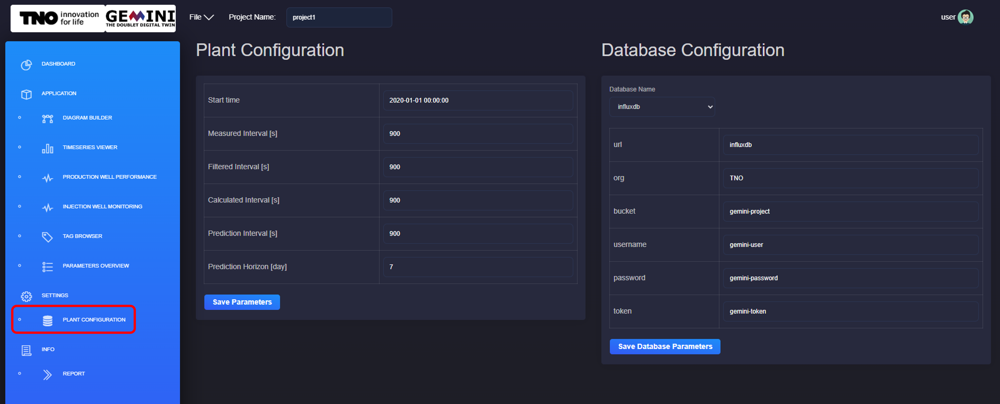
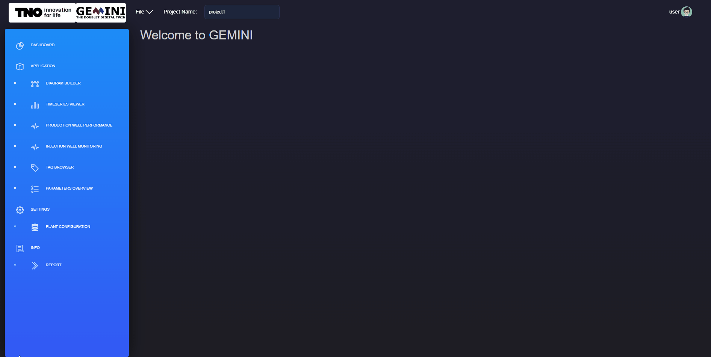

.. _system-setup:

Set-up
==============================================

This section explains how to configure a GEMINI project after creation. It
covers plant diagram setup, parameter configuration, tag mapping, plant-level
settings, and report/document handling.

Before starting, make sure you have created and opened a project as described in
:ref:`Projects <projects>`.

Creating a plant diagram
--------------------------------------------
After opening a project, start by defining the plant geometry in the
*Diagram Builder* application.

.. _new-component:

    Adding new component in the plant diagram from the *diagram builder* application.

For a new project, the canvas is empty. Add the required components by selecting
them from the component list at the bottom of the screen (see
:numref:`new-component`).

.. _add-move-component:

    Moving component on canvas from the *diagram builder* application.

When a component is added, it appears on the top-left of the canvas. Drag and
drop it to the preferred location (see :numref:`add-move-component`).

.. _connect-components:

    Creating a connection between two components from the *diagram builder* application.

Connect components to define process flow relations. Create a connection by
clicking and dragging from one connection point to another, as shown in
:numref:`connect-components`.

Adding asset parameters
--------------------------------------------
After creating the diagram, define parameters for each asset through
*Diagram Builder*.

.. _edit-component-parameters:

    Edit components parameters from the *diagram builder* application.

Right-click a component and open its parameter editor. Figure
:numref:`edit-component-parameters` shows an example for a production well.
After editing values, click **SAVE** to persist changes to the project JSON
files. Repeat for all relevant components.

For production and injection wells, trajectory data is required.

Linking tags to plant assets
--------------------------------------------

A tag links model variables to database values. Each tag has:

* a **tag name** (human-readable descriptor)
* a **tag value** (database variable reference)

.. _edit-component-tags:

    Edit components tags from the *diagram builder* application.

To configure tags, open *Diagram Builder*, right-click the asset, select
``Open Parameter``, then switch to the **Tagnames** tab and enter tag values.
Use consistent naming and avoid typos, as shown in :numref:`edit-component-tags`.

Viewing plant configuration and parameters
--------------------------------------------

Use the *PLANT CONFIGURATION* application (under *SETTINGS*) to configure
project-wide plant and database parameters.

Plant settings include:
    - Start time
    - Measured Interval, in seconds
    - Filtered Interval, in seconds
    - Calculated Interval, in seconds
    - Prediction Interval, in seconds
    - Prediction Horizon, in days

Database settings include:
    - Database name, from the dropdown menu
    - url
    - organisation
    - bucket
    - username
    - password
    - token

.. _plant-configuration:

    Configure the plant parameters and the database parameters from the *PLANT CONFIGURATION* window.

Click **Save** to persist configuration updates (see
:numref:`plant-configuration`).

Uploading and viewing documents
--------------------------------------------
The report library lets you upload and access project documents from one place.
Supported uploads are PDF files, stored in your account/project context.

.. _report-upload-view:

    Upload and view pdf report from the *REPORT* window.

To upload a report, open *INFO* -> *REPORT*, select a local file, and click
**Upload**. Uploaded files are available from the report dropdown. Use **Delete**
to remove obsolete documents (see :numref:`report-upload-view`).
